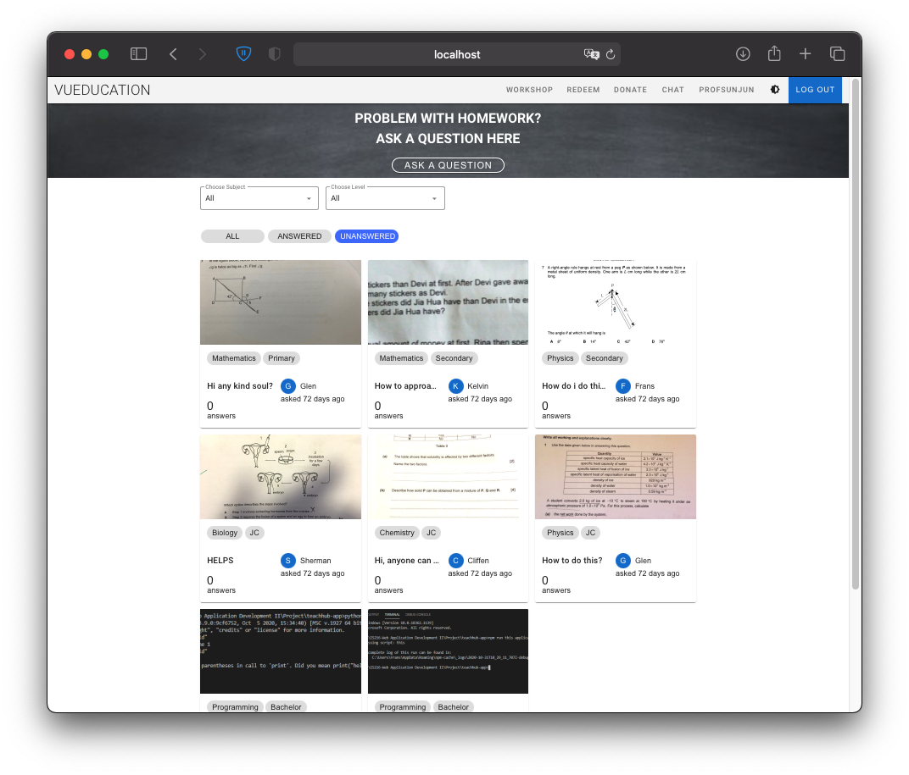
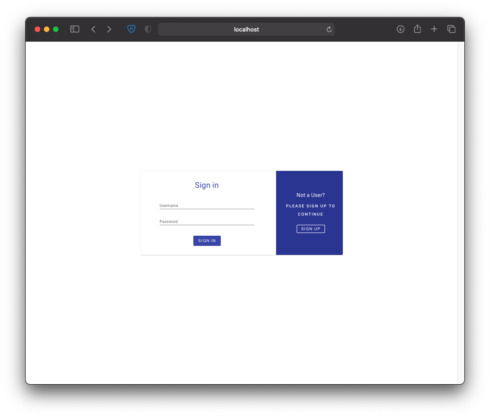
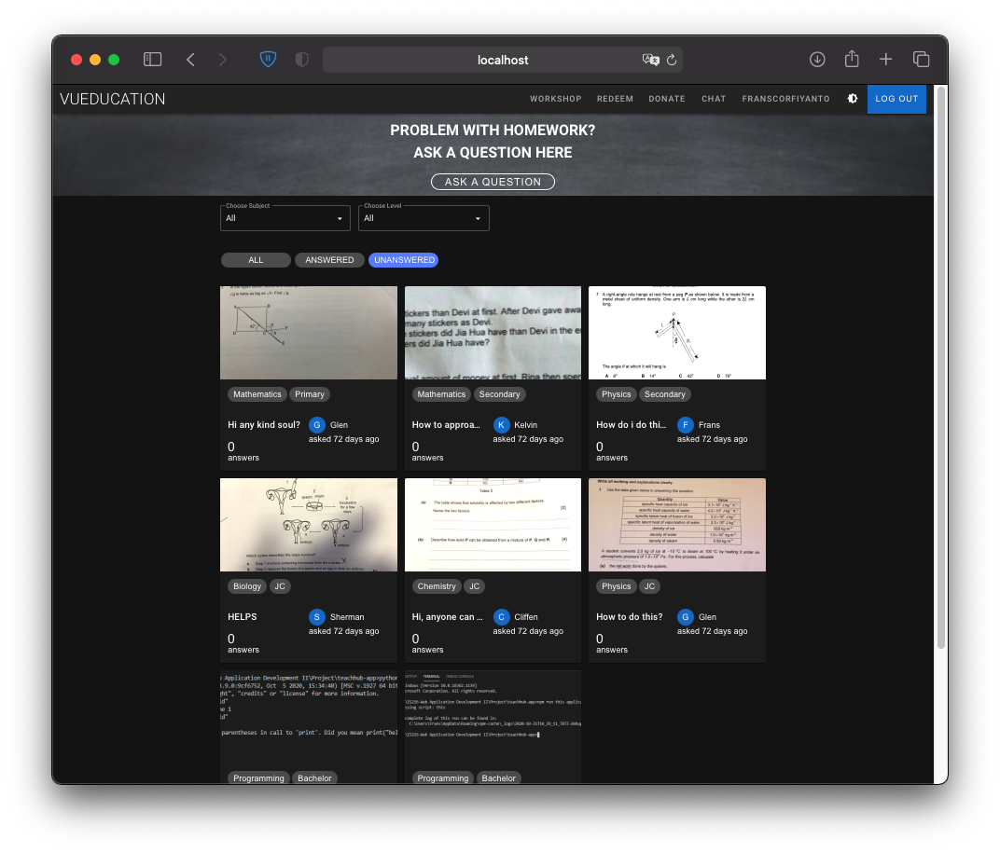
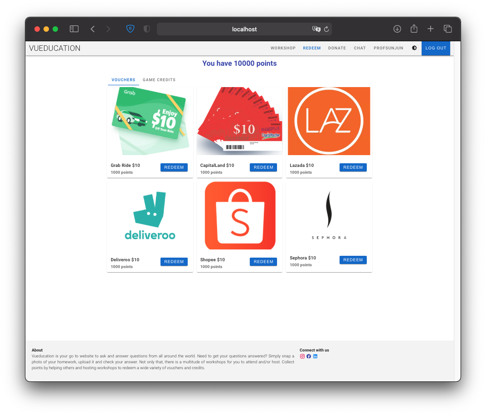
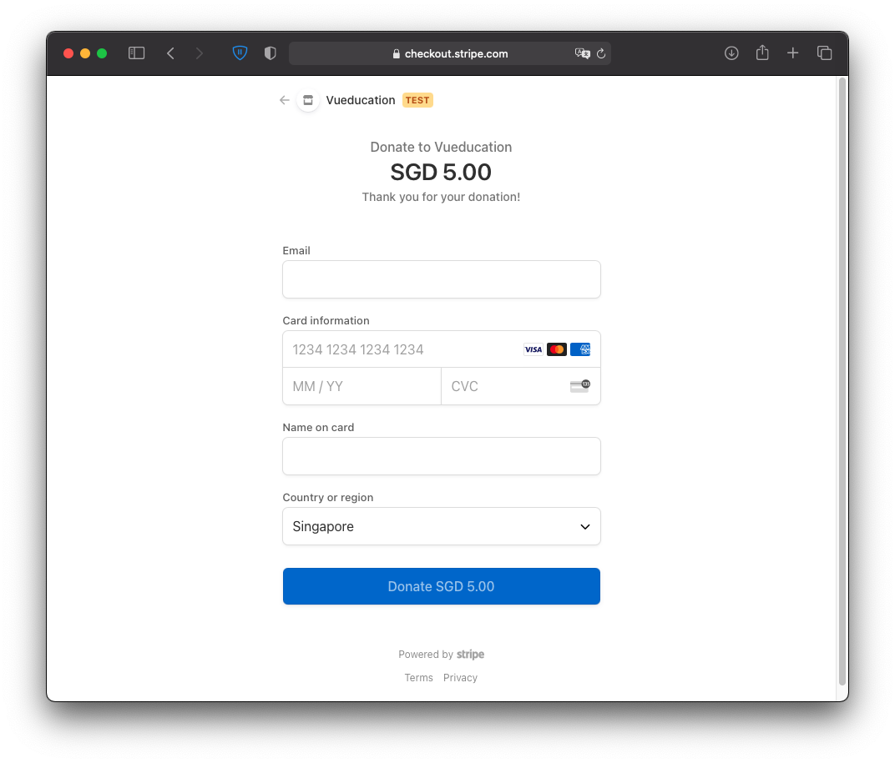
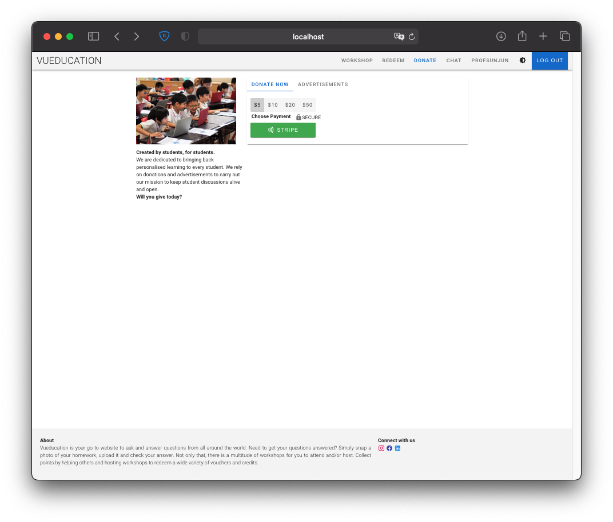
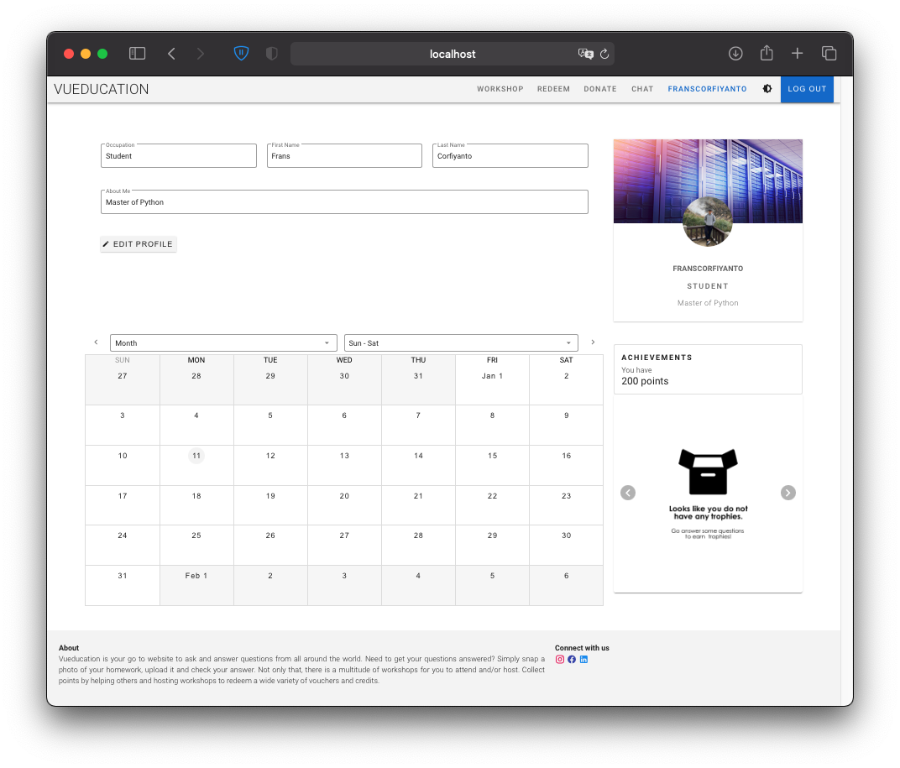
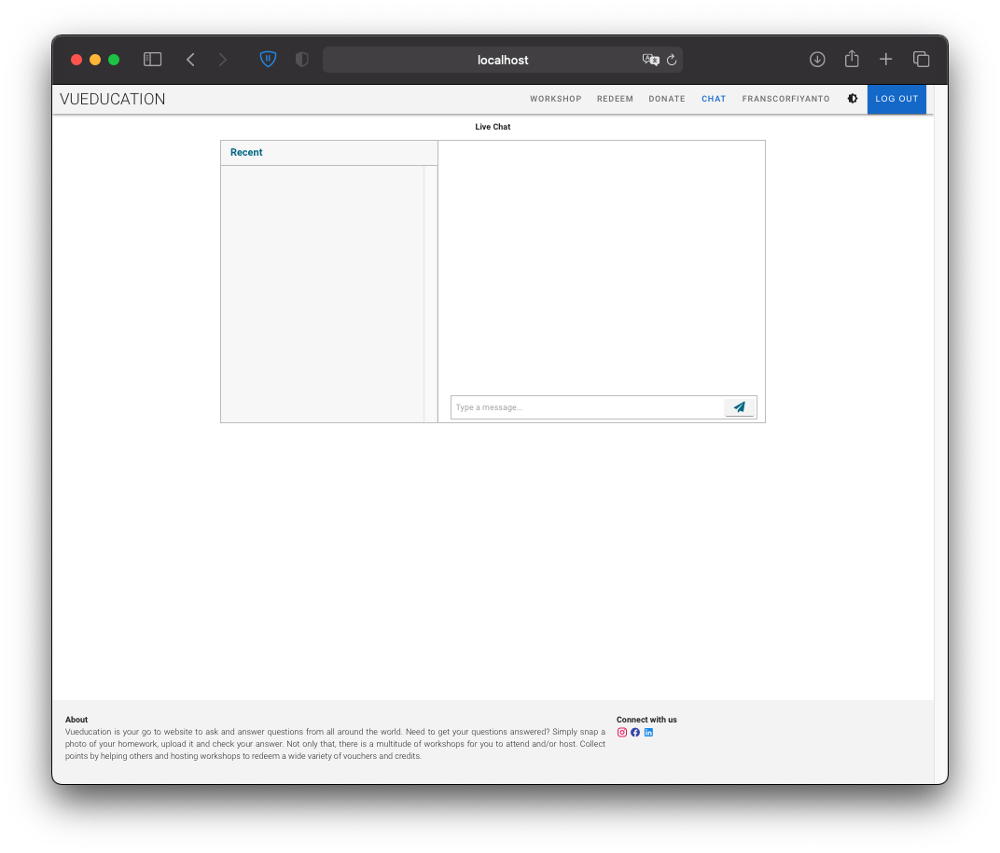

# Vueducation

## Preview (scroll to the bottom for more)


## Setting Up

### Backend (Flask)

In order to setup our backend application, we need to install the necessary Python Packages.

**Windows** 
```bash
pip install -r requirements.txt
```

**Mac**
```bash
pip3 install -r requirements.txt
```

Next, we can run the backend Flask Application that serves the data for our Frontend

**Windows**
```bash
cd app

python backend/app.py
```

**Mac**
```bash
cd app

python3 backend/app.py
```

### Frontend (Nuxt)

In order to setup our backend application, we need to install the necessary Node Modules.
Open another terminal (Make sure you are at root folder)

```bash
cd app

npm install
```

Next, we can run the Frontend, which will serve the Frontend on http://localhost:3000/app

```bash
npm run dev
```

### Database

As all our Database are deployed on cloud, there is no need for the Teaching Team to configure anything.


### Login Credential

These are the following accounts that we used for our Demo

1. **franscorfiyanto**
* username: franscorfiyanto
* password: password

2. **profsunjun**
* username: profsunjun
* password: password

### Stripe API Credential

* Card Number: 4242 4242 4242 4242

The rest of the field can be anything

### Workshops
The video link for a livestream and a traditional video on youtube are formatted the same and presented in identical iframe elements.
Thus the code implementation would be the same as shown in this application.









